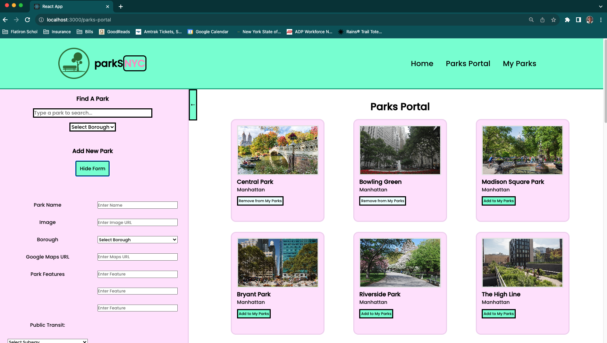

# parkSNYC: A Resource For Finding & Visiting NYC Parks

## Built With
This application was built with React.js and a JSON Server.

***

## Getting Started

### Run server (terminal 1): 
• run npm install -g json-server

• run json-server --watch db.json --port 4001

### Run client (terminal 2): 

• run npm install & npm start

***

## About The App

parkSNYC is a resource for finding and visiting NYC parks. The frontend user interface was engineered using Javascript, React, and responsive design techniques. The frontend application communicates with a JSON server that houses in-depth park information about 25 New York City parks. The application utilizes React Router as the client-side routing method, in order to change what the user sees on the page based on the URL.

***

## Contact
Project Team: Sarah Jones & Patrick Roberts

Sarah Jones - sarahrjones8@gmail.com - https://www.linkedin.com/in/srjones02/

Project Link: https://github.com/sarahjones016/phase-2-final-project 